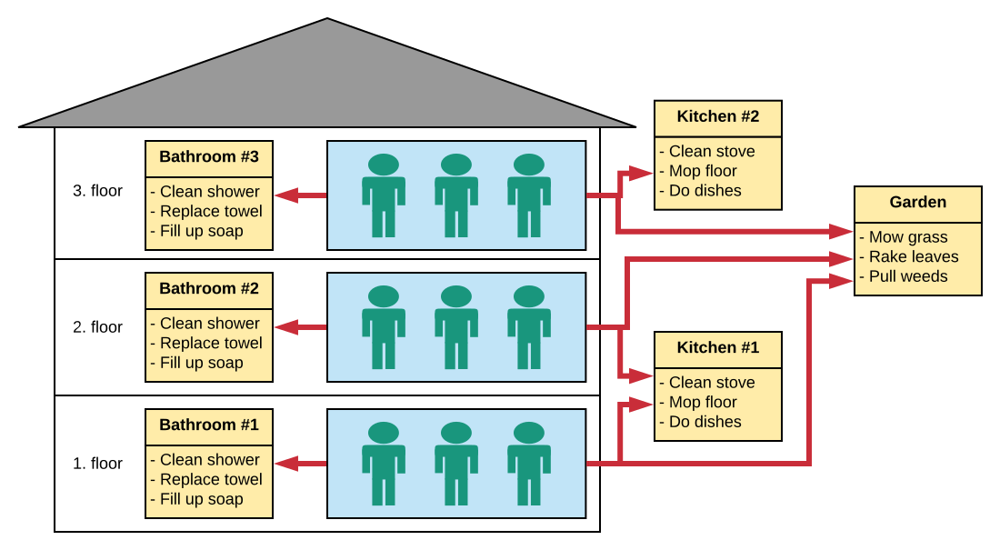
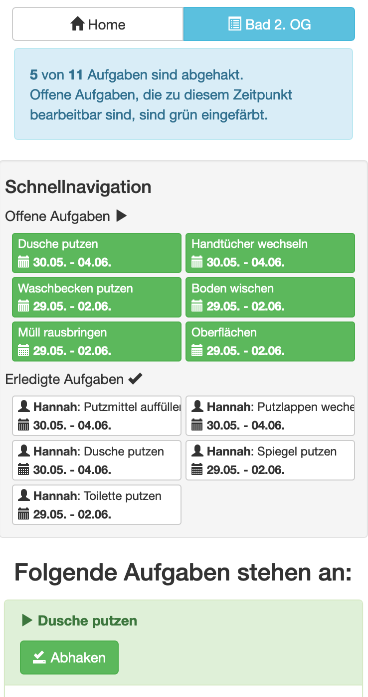
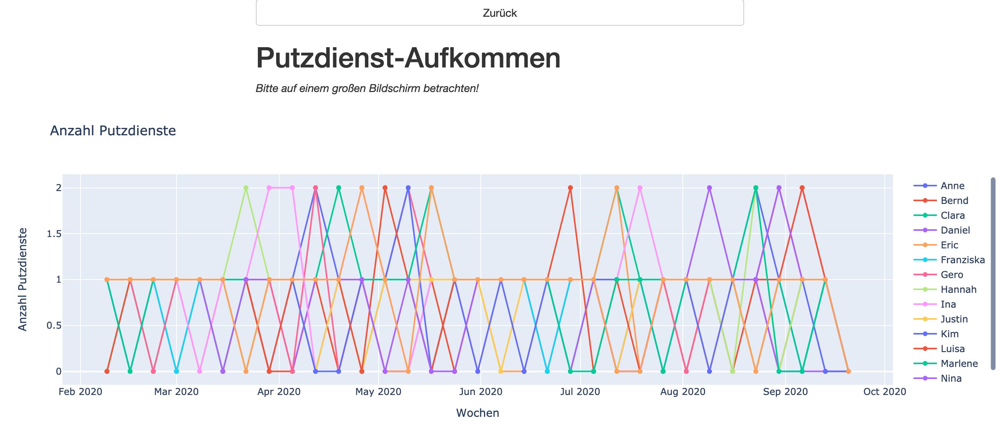
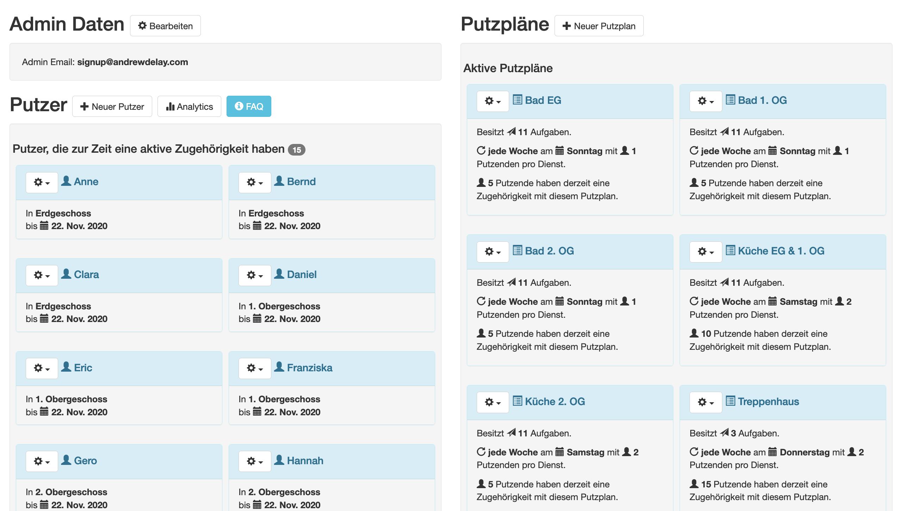
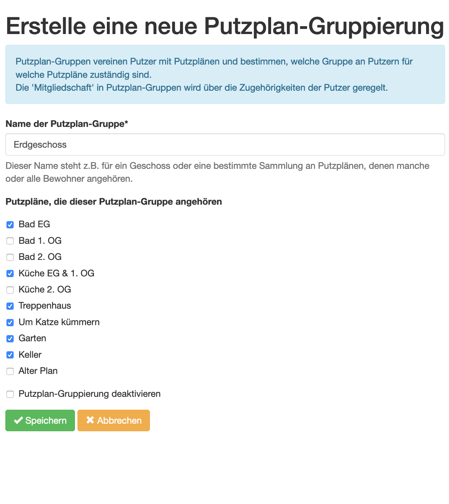
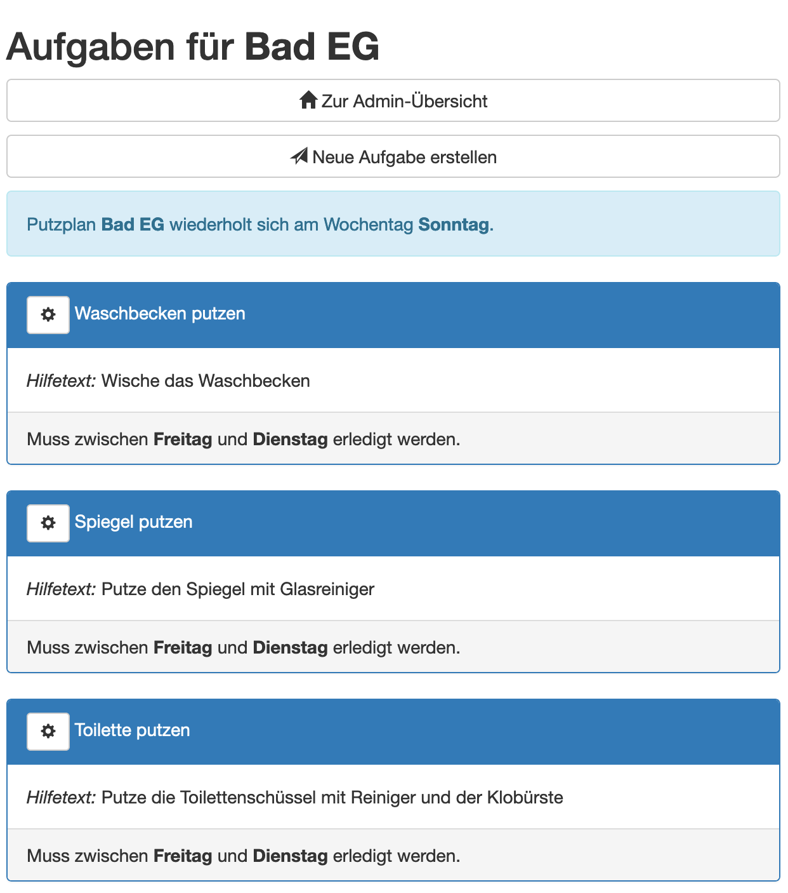

# Cleaning schedule management system (CleanSys)

CleanSys is a *cleaning schedule management system* written in Python (using the Django framework) which is built for 
large households with many cleaning schedules and time-variant relationships between Cleaners and Schedules. 

It makes sure that:   
- Every Cleaner cleans his/her fair share in each cleaning schedule he/she is assigned
 to *(not cleaning too much or too little)*.
- A Cleaner's work load is spread out over time as much as possible.  

*A simplified example of a use-case:*


CleanSys was built for a 15-person household with 4 floors. 
Each floor has its own weekly repeating cleaning schedules, two kitchens which some floors share, and 
several schedules which apply to the entire household. 

This cleaning-schedule management system takes over the tedious task of creating schedules on paper 
and provides additional features, such as a quick and easy way for Cleaners to switch duties with each other.

CleanSys comes with powerful editing capabilities for the administrator, an intuitive interface for the Cleaners, 
simple click-on-your-name login, and a strong focus on transparency with a granularity down to the 
 sub-task level of each schedule.  

This project was made with german users in mind, so the interface language is german as well. 
If you would like to have a translation 
(and are willing to put some effort into it yourself), please open an Issue for it. 

## Screenshots
Here is a selection of CleanSys' pages:

#### Cleaner's pages (best on mobile clients)
Login page | Cleaner's main page | Duty tasks page | Schedule overview (current week is highlighted) 
--- | --- | --- | ---
 |  |  |  | 

Schedule print view | Analytics page showing assignment count of all cleaners over time 
--- | ---
 | 

#### Admin pages
Administration main page | Cleaner creation form | Schedule creation form
--- | --- | ---
 |  | 

Schedule group creation form | Affiliate a Cleaner with a schedule group | Tasks for a specific schedule | Add a new task to a schedule
--- | --- | --- | ---
 |  |  | 

# Installation (local)
> Should work on Unix systems and are verified on Mac OSX

### 1. Clone the project
Clone the project into your workspace: 

```bash
cd /path-to-workspace/
git clone https://github.com/monoclecat/cleansys.git
cd cleansys
```

### 2. Create a virtual environment and activate it
A virtual environment isolates Python environment of CleanSys from your system's Python environment. 

```bash
pip3 install virtualenv  # If you haven't installed the virtualenv package
virtualenv -p python3 .  # Create virtualenv inside the newly cloned repository
source bin/activate  # activate the virtualenv
```

### 3. Installing required packages
The required pip packages and their versions are listed in `requirements.txt`. 
Install them into your virtualenv's site-packages:

```bash
pip3 install -r requirements.txt
``` 

### 4. Setting up the database
This Git ships without a database and any migrations. Create them with:

```bash
python manage.py makemigrations
python manage.py migrate
```
 
This will set up an empty database with all the required tables and columns. 

The admin area of CleanSys uses the login of the Django superuser. Create one with:

```bash
python manage.py createsuperuser
``` 

### 5. Playing around an exploring features
The best place to start is to set up the demonstration database. To set it up, run:

```bash
python manage.py create_demo_database
```

### 6. Starting the Django server
Finally, start the Django server:

```bash
python manage.py runserver
``` 

# Installation (on an Ubuntu server)

Follow steps 1 through 5 of the previous instructions, substituting `path-to-workspace` with `/var/www/`. 
Also, you will run into 'Permission denied' errors if you don't run some of the command as root 
(prepend `sudo ` to the command). 

I first had to install pip3 `sudo apt install python3-pip`

Change the ownership of the directory `cleansys` to your username, create the virtualenv in it without using sudo and
install the pip packages inside `requirements.txt` without using sudo 
*([installing pip packages using sudo is a major security risk](https://stackoverflow.com/a/21056000/5568461))*:
```bash
cd /var/www
sudo chown -R your_username:your_username cleansys  # Your user needs ownership of cleansys/

virtualenv -p python3 cleansys/
cd cleansys

source bin/activate  # Don't forget to activate the virtual environment!!!
python3 -m pip install -r requirements.txt

python3 manage.py makemigrations
python3 manage.py migrate

deactivate  # Deactivate virtualenv
```

Now, we will follow a recommended way of deploying Django: 
[How to use Django with Apache and mod_wsgi](https://docs.djangoproject.com/en/3.0/howto/deployment/wsgi/modwsgi/)

Install requirements:

```bash
sudo apt-get install libapache2-mod-wsgi-py3 apache2
```

Give the user `www-data` ownership of `cleansys`:
```bash
cd /var/www
sudo chown -R www-data:www-data cleansys  # Give Apache's user ownership so it can serve the files
```

Create an Apache site-configuration file:
```bash
sudo vim /etc/apache2/sites-available/cleansys.conf
```

This opens the Vim editor. Press <kbd>i</kbd> and page the following: 

```html
 WSGIDaemonProcess cleansys python-home=/var/www/cleansys python-path=/var/www/cleansys
 WSGIProcessGroup cleansys

 <VirtualHost *:80>
     Alias /static/ /var/www/cleansys/barsys/static/
     <Directory /static>
         Require all granted
     </Directory>
     WSGIScriptAlias / /var/www/cleansys/cleansys/wsgi.py process-group=cleansys
     <Directory /var/www/cleansys/cleansys>
         <Files wsgi.py>
             Require all granted
         </Files>
     </Directory>
 </VirtualHost>
```

## "I can't run virtualenv or pip install without sudo!"

Make sure there is no system-wide installed version of virtualenv. **virtualenv is meant to be run as a non-root user**, 
and installing virtualenv as root prevents this 
(see [this](https://stackoverflow.com/a/19472082/5568461) and [this](https://stackoverflow.com/a/9349150/5568461))
In my case, after trying around, I had installed virtualenv once via pip3 with sudo and once via apt with sudo, 
so I had to uninstall it twice with: 

```bash
sudo python3 -m pip uninstall virtualenv
sudo apt remove virtualenv
```

And then install it for my local user without root (notice the `--user` flag):

```bash
sudo python3 -m pip install virtualenv --user
```

Upon which I also received this important warning (I obfuscated by username with `<username>`): 

```bash
WARNING: The script virtualenv is installed in '/home/<username>/.local/bin' which is not on PATH.
  Consider adding this directory to PATH or, if you prefer to suppress this warning, use --no-warn-script-location
```

This told me that the path that the local pip3 package was installed to wasn't in my PATH variable. The PATH variable 
(see its value with `echo $PATH`) stores the directory of executables and is set in `~/.profiles`. 
Checking `~/.profiles` revealed an if-statement which adds the exact directory mentioned above to `$PATH` if it 
exists. But here is the catch: `~/.profiles` is only run when you login to your server. 
So the solution is to simply restart your session (<kbd>CTRL+D</kbd> and log in again). 

