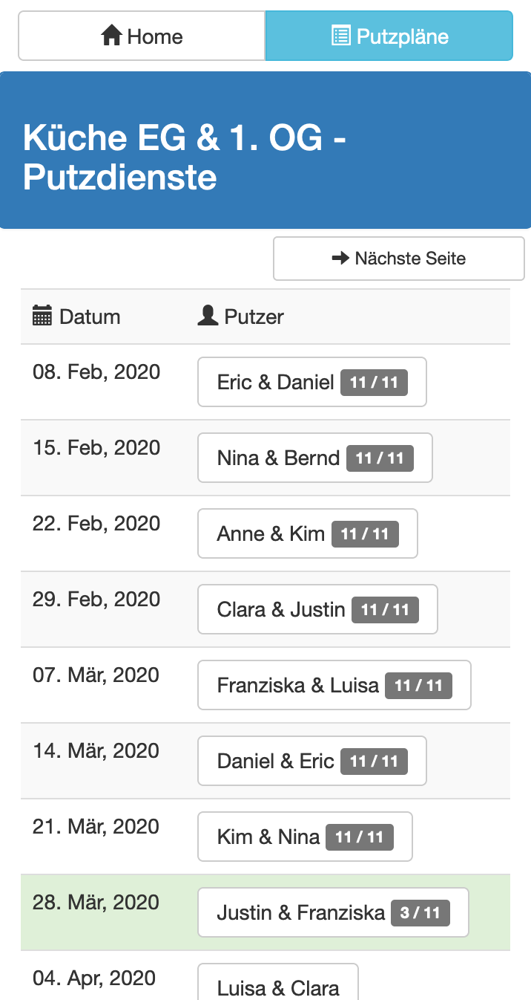
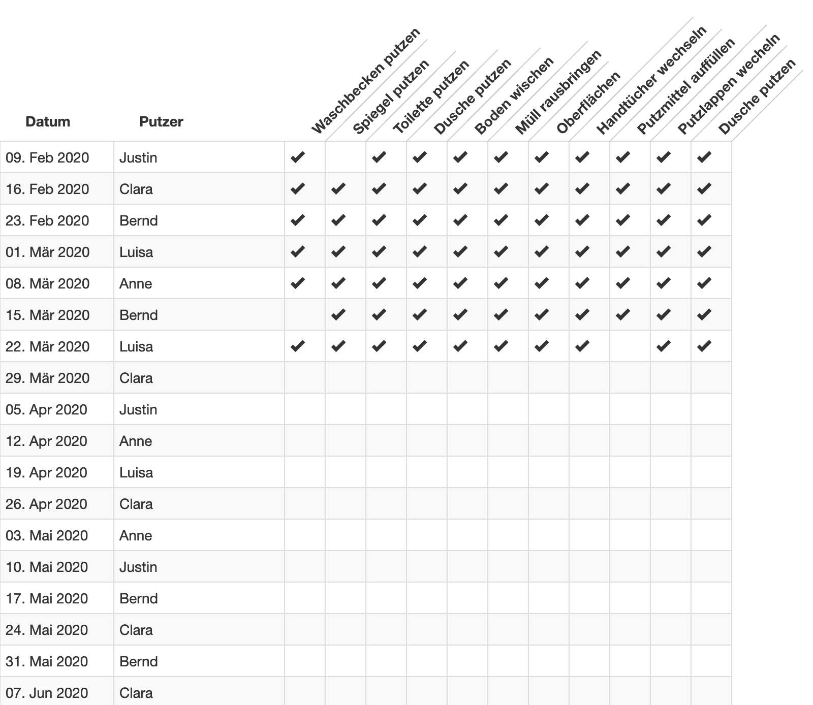
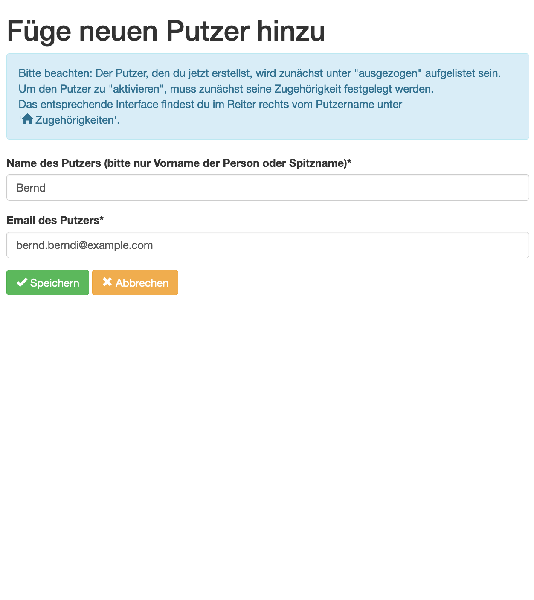
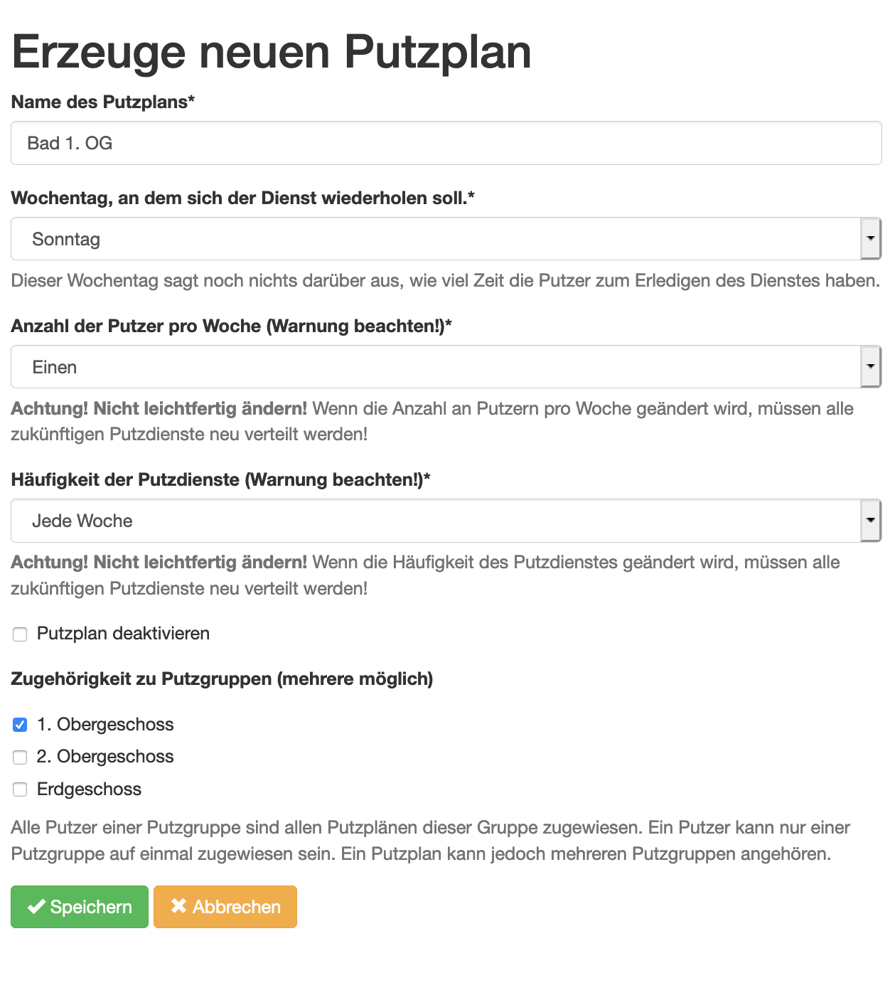
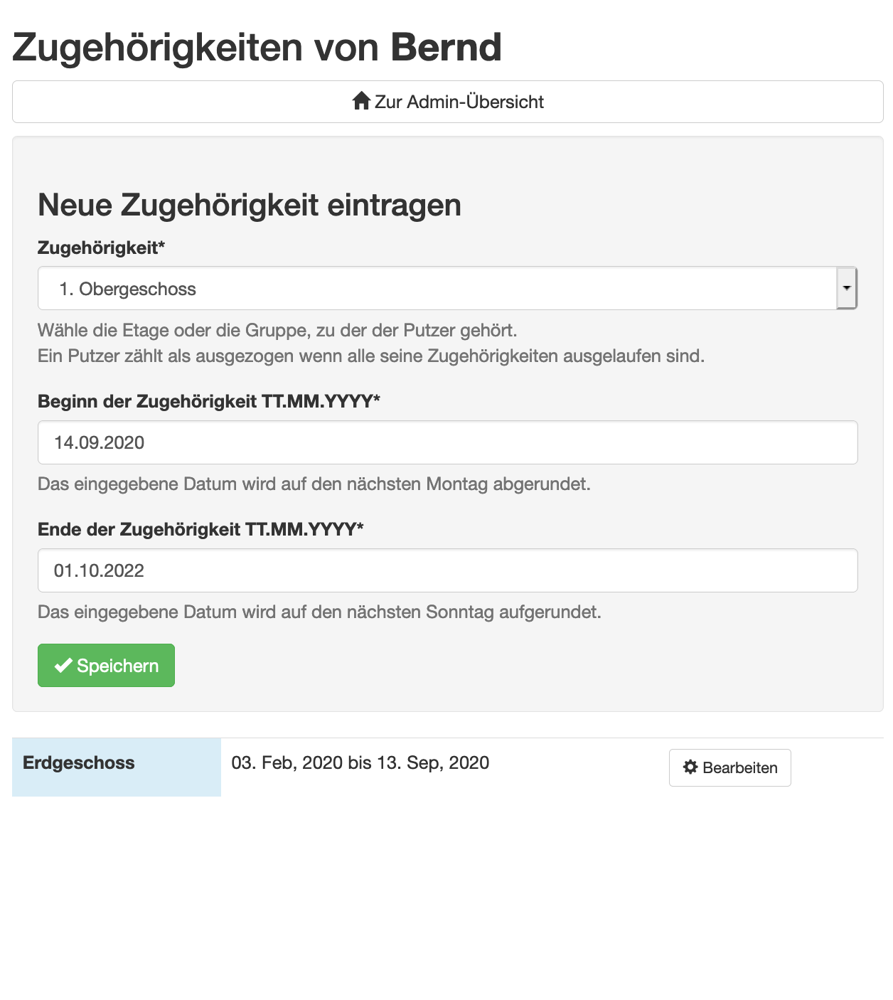

# Cleaning schedule management system (CleanSys)

CleanSys is a *cleaning schedule management system* written in Python (using the Django framework) which is built for 
large households with many cleaning schedules and time-variant relationships between Cleaners and Schedules. 

It makes sure that:   
- Every Cleaner cleans his/her fair share in each cleaning schedule he/she is assigned
 to *(not cleaning too much or too little)*.
- A Cleaner's work load is spread out over time as much as possible.  

*A simplified example of a use-case:*


CleanSys was built for a 15-person household with 4 floors. 
Each floor has its own weekly repeating cleaning schedules, two kitchens which some floors share, and 
several schedules which apply to the entire household. 

This cleaning-schedule management system takes over the tedious task of creating schedules on paper 
and provides additional features, such as a quick and easy way for Cleaners to switch duties with each other.

CleanSys comes with powerful editing capabilities for the administrator, an intuitive interface for the Cleaners, 
simple click-on-your-name login, and a strong focus on transparency with a granularity down to the 
 sub-task level of each schedule.  

This project was made with german users in mind, so the interface language is german as well. 
If you would like to have a translation 
(and are willing to put some effort into it yourself), please open an Issue for it. 

## Screenshots
Here is a selection of CleanSys' pages:

#### Cleaner's pages (best on mobile clients)
Login page | Cleaner's main page | Duty tasks page | Schedule overview (current week is highlighted) 
--- | --- | --- | ---
 |  |  |  | 

Schedule print view | Analytics page showing assignment count of all cleaners over time 
--- | ---
 | 

#### Admin pages
Administration main page | Cleaner creation form | Schedule creation form
--- | --- | ---
 |  | 

Schedule group creation form | Affiliate a Cleaner with a schedule group | Tasks for a specific schedule | Add a new task to a schedule
--- | --- | --- | ---
 |  |  | 

# Installation (local)
> Should work on Unix systems and are verified on Mac OSX

### 1. Clone the project
Clone the project into your workspace: 

```bash
cd /path-to-workspace/
git clone https://github.com/monoclecat/cleansys.git
cd cleansys
```

### 2. Create a virtual environment and activate it
A virtual environment isolates Python environment of CleanSys from your system's Python environment. 

```bash
pip3 install virtualenv  # If you haven't installed the virtualenv package
virtualenv -p python3 .  # Create virtualenv inside the newly cloned repository
source bin/activate  # activate the virtualenv
```

### 3. Installing required packages
The required pip packages and their versions are listed in `requirements.txt`. 
Install them into your virtualenv's site-packages:

```bash
pip3 install -r requirements.txt
``` 

### 4. Creating your own settings
Copy the directory `cleansys/setting_templates` to `cleansys/settings`. 
Upon start-up, Django will auto-detect the new `settings` directory and will run the import statements 
in `__init__.py`. 
Only change files in `cleansys/settings`, as this directory is mentioned in  
`.gitignore` and won't cause issues when updating CleanSys. 

It is very important that you give a new value to the `SECRET_KEY`'s 
in both `dev_settings.py` and `prod_settings.py` (the `SECRET_KEY` in both files may not be the same!).


`common_settings.py` contains settings not in need of modification. 


### 5. Setting up the database
This Git ships without a database and any migrations. Create them with:

```bash
python manage.py makemigrations
python manage.py migrate
```
 
This will set up an empty database with all the required tables and columns. 

The admin area of CleanSys uses the login of the Django superuser. Create one with:

```bash
python manage.py createsuperuser
``` 

### 6. Playing around an exploring features
The best place to start is to set up the demonstration database. To set it up, run:

```bash
python manage.py create_demo_database
```

### 7. Starting the Django server
Finally, start the Django server:

```bash
python manage.py runserver
``` 

### Last notes

If you are using a Python IDE such as PyCharm (I very much recommend), you might come across this error
when opening the Python Console or running tests from the test parent directory (`webinterface/tests`):

```
django.core.exceptions.ImproperlyConfigured: Requested setting INSTALLED_APPS, but settings are not configured. 
You must either define the environment variable DJANGO_SETTINGS_MODULE or call settings.configure() before accessing settings.
```

In this case, open `PyCharm > Preferences > Build, Execution, Deployment > Console` and add 
`DJANGO_SETTINGS_MODULE=cleansys.settings` to the `Environment Variables` field of the Django Console.

If you are getting this error when running tests, do the same to 
`Run/Debug Configurations > Edit Configurations... > Templates > Django Tests` 
and to your existing tests configurations.
 
# Deployment on an Ubuntu server

Installing CleanSys on an Ubuntu server is very similar to the installation on a Unix system, such as a Mac. 

## Installation

Follow steps 1 through 6 of the previous instructions, substituting `path-to-workspace` with `/var/www/`. 
Also, you will run into 'Permission denied' errors if you don't run some of the command as root 
(prepend `sudo ` to the command). 

I first had to install pip3 `sudo apt install python3-pip`

Change the ownership of the directory `cleansys` to your username, create the virtualenv in it without using sudo and
install the pip packages inside `requirements.txt` without using sudo 
*([installing pip packages using sudo is a major security risk](https://stackoverflow.com/a/21056000/5568461))*. 

> Having problems creating a virtualenv without sudo? [Read this](#virtenvsudo)

```bash
cd /var/www
sudo git clone https://github.com/monoclecat/cleansys.git
sudo chown -R "$USER":"$USER" cleansys  # Your user needs ownership of cleansys/

virtualenv -p python3 cleansys/
cd cleansys

source bin/activate  # Don't forget to activate the virtual environment!!!
python3 -m pip install -r requirements.txt

python3 manage.py makemigrations
python3 manage.py migrate
python3 manage.py createsuperuser


deactivate  # Deactivate virtualenv
```

> You can only run manage.py commands while you own the database file db.sqlite3 and its parent folder, cleansys/. 
> Later, the ownership will be transferred to Apache's www-data user. 

Don't forget to create the `settings` directory from `settings_template`:
 
```bash
cd /var/www/cleansys/cleansys
sudo cp setting_templates/ settings -R  # Duplicate and rename settings_template/
``` 

Adapt `dev_settings.py` and `prod_settings.py`, and make sure `__init__.py` imports the settings you want 
(edit files using the vim editor with `sudo vim filename`). 

When adapting the production settings, please follow the 
[Django deployment checklist](https://docs.djangoproject.com/en/3.0/howto/deployment/checklist/). 
Necessary edits include:

- Setting `ALLOWED_HOSTS` 
- Setting a new `SECRET_KEY`
- Setting `ADMINS`
- Setting the SMTP login credentials (if no email fault reporting is wished, remove the line which sets 
`LOGGING['loggers']['django.request']`)

The last step before setting up the server is to create the `logs` and `media` directories:

```bash
sudo mkdir /var/www/cleansys/logs
sudo mkdir /var/www/cleansys/media
```

### Setting up the server

Now, we will follow a recommended way of deploying Django: 
[How to use Django with Apache and mod_wsgi](https://docs.djangoproject.com/en/3.0/howto/deployment/wsgi/modwsgi/)

Install requirements:

```bash
sudo apt-get install libapache2-mod-wsgi-py3 apache2
```

> When running CleanSys with Apache, server errors and access logs won't be printed into the console 
> but can be found in the logs under `/var/log/apache2`.

By installing Apache, a new user has been created on your system: `www-data`, along with a new group with 
the same name. Following [this informative AskUbuntu answer](https://askubuntu.com/a/46371), we will now
add our user to the `www-data`-**group**. Then, the ownership of all files and directories will be 
transferred to your user and the `www-data`-group. 

> This allows us to split up the permissions for the files and directories. 
> Running `chmod 640` on a file will give the owning user read+write permissions (`6`), 
> all users in the owning group read permissions (`4`) and any other user no permissions (`0`). 
> Read more about permissions in the [chmod command help](https://www.computerhope.com/unix/uchmod.htm).  

Add your user to the `www-data` group and log out and back in to the server to make the group change take effect.  

```bash
sudo gpasswd -a "$USER" www-data
```
<a name="perms"></a>
Now we will set the permissions. We will only give the `www-data`-group write access where necessary. 

```bash
sudo chown -R "$USER":www-data /var/www  # Set ownership recursively

find /var/www/ -type f -exec chmod 0640 {} \;
sudo find /var/www -type d -exec chmod 2750 {} \;  # The '2' sets the setgid bit so that all new files inherit the same group

chmod g+w /var/www/cleansys  # Add write permissions to group
chmod g+w /var/www/cleansys/db.sqlite3
chmod g+w /var/www/cleansys/logs
chmod g+w /var/www/cleansys/media
```

> At any time, you can check if the `www-data` user has sufficient privileges to successfully start the server by 
> running `sudo -u www-data bash -c "source bin/activate; python3 manage.py runserver"`

Create an Apache site-configuration file:
```bash
sudo vim /etc/apache2/sites-available/cleansys.conf
```

This opens the Vim editor. Press <kbd>i</kbd> and paste the following: 

```html
 WSGIDaemonProcess cleansys python-home=/var/www/cleansys python-path=/var/www/cleansys
 WSGIProcessGroup cleansys

 <VirtualHost *:80>
     Alias /static/ /var/www/cleansys/webinterface/static/
     <Directory /static>
         Require all granted
     </Directory>
     WSGIScriptAlias / /var/www/cleansys/cleansys/wsgi.py process-group=cleansys
     <Directory /var/www/cleansys/cleansys>
         <Files wsgi.py>
             Require all granted
         </Files>
     </Directory>
 </VirtualHost>
```

Save the file by first pressing <kbd>esc</kbd> to leave insert mode and then 
pressing <kbd>:wq</kbd> (<kbd>:</kbd>: "Command", <kbd>wq</kbd>: "Write and quit").

Now, disable apache2 default site that uses port 80, enable cleansys site and restart apache2:

```bash
sudo a2dissite 000-default
sudo a2ensite cleansys
sudo systemctl restart apache2
```

Keep in mind that CleanSys is only meant to be accessible inside your local network.  

When changing any file or ownership, you will have to reload Apache for the changes to take effect. 
```bash
sudo systemctl reload apache2
```

### Creating Cronjobs

Cronjobs are great for automating things. For CleanSys, a Cronjob which runs `cronscripts/create_assignments.sh` once
a week will make sure there are always Assignments for the next `WARN_WEEKS_IN_ADVANCE__ASSIGNMENTS_RUNNING_OUT + 4`
weeks (see `webinterface/management/commands/create_assignments.py`). 
A good documentation on Cron can be found [here](https://help.ubuntu.com/community/CronHowto).  

We will be putting our Cronjobs into the system Crontab under `/etc/crontab`. 
Just open the file with your favorite terminal editor using sudo (ex. `sudo vim /etc/crontab`) and 
append the examples below to the file.    

> To test a Cronjob you can initially set its interval to `*/1 * * * *` to run it every minute. 

The following job will run `cronscripts/create_assignments.sh` (mentioned above) every
Monday at 3:00 in the morning: 
```bash
0 3 * * 0 www-data bash /var/www/cleansys/cronscripts/create_assignments.sh >> /var/www/cleansys/logs/cron.log
``` 

The following job will run `cronscripts/create_plots.sh` every Monday at 3:15 in the morning. 
These plots will be shown in the Cleaner and Schedule analytics views. 
Creating these plots once and just loading their html when the page is called saves a lot of ressources.  
```bash
15 3 * * 0 www-data bash /var/www/cleansys/cronscripts/create_plots.sh >> /var/www/cleansys/logs/cron.log
``` 

The following job will create a gzipped backup of `db.sqlite3` and put it in `/var/www/cleansys/backups` 
every day at 4 in the morning: 
```bash
0 4 * * * www-data bash /var/www/cleansys/cronscripts/create_backup.sh >> /var/www/cleansys/logs/cron.log
``` 

The following job will send the database file to all admins mentioned in the ADMINS setting every Monday at 
3:30 in the morning:
```bash
30 3 * * 0 www-data bash /var/www/cleansys/cronscripts/send_database_backup.sh >> /var/www/cleansys/logs/cron.log
``` 


#### Cronjobs aren't working?
Debugging Cronjobs is a bit tricky. The log output given by `tail /var/log/syslog` will not give you any 
information useful for debugging. Instead, Cronjobs will send errors by *email*. 
If you have no email server set up, you will find messages such as *"No MTA installed"* in `/var/log/syslog`. 

Setting up an email server and client is actually very simple. 
There are enough good tutorials when searching for *ubuntu setting up postfix with mutt*. 
Basically, you need to install `postfix`, set it to *Local only*, and install the email client `mutt`. 

Cron will be sending emails to postbox of user `www-data`, 
so be sure to run the email client with `sudo -H -u www-data mutt`, 
otherwise you will access your logged-in user's postbox.  
 

## Updating
Before updating, make sure to create a backup of your current installation. 
Then, check to see if there have been any changes since the last pull.

```bash
sudo systemctl stop apache2
cd /var/www
sudo cp -a cleansys /var/backups/<current_date>-cleansys  # Create a backup
cd cleansys
git diff
```

If you haven't worked on the code, `git diff` shouldn't return anything. 
Take note on any changes you see and decide if they are relevant, 
as in the update process all these changes will be thrown away and must be re-done afterwards. 

Next, show differences between the settings you have modified from the templates, and the templates themselves. 
Screenshot this! You will need it soon. 

```bash
cd /var/www/cleansys/cleansys
diff setting_templates/ settings/
```

Now comes the actual update: We pull the newest commit from this repository on Github. 

```bash
git add -A .  # Track untracked files that could get in the way
git stash  # Any changes to files are 'stashed' to be thrown away later
git pull
git stash pop  # Throw away changes
```  

It is possible that the settings templates have changed and that settings have been added. 
`cleansys/setting_templates` is not read by the Django server, only `cleansys/settings`. 
But the update may contain changes to the settings, which are now only in `cleansys/setting_templates`
and must be transferred to `cleansys/settings`. 

To see if any action is necessary, check the differences again between the files of both directories: 

```bash
cd /var/www/cleansys/cleansys
diff setting_templates/ settings/
```

Compare the output to the screenshot you did before. Anything new? 
Implement any *new* changes in the files of the `settings` directory, so that the output of 
`diff setting_templates/ settings/` matches your screenshot again.   

> In case you are using the `vim` editor *(in constrast to the more intuitive `nano` editor)* 
> to open files in `setting_templates`, make sure to close the editor with 
> <kbd>:q</kbd> (quit) rather than <kbd>:wq</kbd> (write, quit) to ensure you aren't modifying the files 
> there. 

Next, update pip packages with an active virtualenv.

```bash
source bin/activate  # activate the virtual environment
python3 -m pip install -r requirements.txt  # update packages

python3 manage.py makemigrations  # update database structure
python3 manage.py migrate
deactivate
```  

Make sure all files and directories have the correct permissions set, as stated [here](#perms).


Finally, restart your server: 
```bash
sudo systemctl start apache2
```

## Troubleshooting

<a name="virtenvsudo"></a>
### "I can't run virtualenv or pip install without sudo!"

Make sure there is no system-wide installed version of virtualenv. **virtualenv is meant to be run as a non-root user**, 
and installing virtualenv as root prevents this 
(see [this](https://stackoverflow.com/a/19472082/5568461) and [this](https://stackoverflow.com/a/9349150/5568461))
In my case, after trying around, I had installed virtualenv once via pip3 with sudo and once via apt with sudo, 
so I had to uninstall it twice with: 

```bash
sudo python3 -m pip uninstall virtualenv
sudo apt remove virtualenv
```

And then install it for my local user without root (notice the `--user` flag):

```bash
sudo python3 -m pip install virtualenv --user
```

Upon which I also received this important warning (I obfuscated by username with `<username>`): 

```bash
WARNING: The script virtualenv is installed in '/home/<username>/.local/bin' which is not on PATH.
  Consider adding this directory to PATH or, if you prefer to suppress this warning, use --no-warn-script-location
```

This told me that the path that the local pip3 package was installed to wasn't in my PATH variable. The PATH variable 
(see its value with `echo $PATH`) stores the directory of executables and is set in `~/.profiles`. 
Checking `~/.profiles` revealed an if-statement which adds the exact directory mentioned above to `$PATH` if it 
exists. But here is the catch: `~/.profiles` is only run when you login to your server. 
So the solution is to simply restart your session (<kbd>CTRL+D</kbd> and log in again). 


## Acknowledgements

Thanks to @nspo for his mentorship along the way! I recommend his [pybarsys](https://github.com/nspo/pybarsys) 
in case your large household or organization has a bar or a snack cupboard you would like to digitize! 
